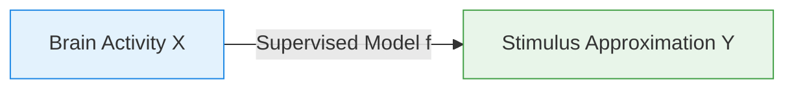

# Direct Mapping

> Mapping neural signals directly to visual pixels or pre-trained features using supervised regression.

Direct mapping is the most fundamental paradigm in visual brain decoding. It models visual reconstruction as a supervised translation task from brain space to stimulus space.

---

## Abstract Paradigm

Given paired training data of brain signals $X$ (e.g., fMRI voxel values, EEG epochs) and visual stimuli $Y$, direct mapping learns a mapping function $f$:

$$\hat{Y} = f(X)$$

This paradigm is typically applied in two ways:

1. **Pixel-Space Mapping**: Predicting raw pixel values directly. This captures basic spatial configurations but yields blurry reconstructions due to voxel noise and spatial smoothing.
2. **Feature-Space Mapping**: Predicting intermediate activations of a pre-trained computer vision model (e.g., CNN layer activations) and then inverting those features back to pixels.

---

## Abstract Solutions

- **Linear / Ridge Regression**: L2-regularized linear models mapping voxels to receptive fields or feature vectors.
- **Voxel-wise Encoding/Decoding**: Estimating Gabor filter responses or motion energy units per visual voxel.
- **Deep Feature Inversion**: Training multi-layer perceptrons (MLPs) or 1D-CNNs to predict deep representations (e.g., AlexNet layers), followed by optimization or a generator to map features back to an image.
