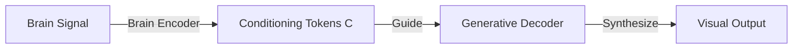

# Generative Conditioning

> Using decoded neural representations as conditioning guidance for generative visual decoders.

Generative conditioning leverages the visual prior of pre-trained generative models (e.g., VAEs, GANs, Diffusion Models, Flow Matching) to synthesize high-fidelity, photorealistic images from coarse neural signals.

---

## Abstract Paradigm

A brain encoder projects brain signals into a set of conditioning keys/tokens $C$. These tokens are then passed to a frozen or fine-tuned generative network, steering the generation process toward the target visual attributes while the generative prior ensures natural image output.

This paradigm decouples the task of **understanding visual features from brain signals** (handled by the encoder) from the task of **synthesizing realistic pixels** (handled by the generative model).

---

## Abstract Solutions

- **VAE Latent Conditioning**: Mapping brain signals directly to the latent space of a Variational Autoencoder to generate layout and color blocks.
- **Diffusion Guidance**: Injecting decoded brain embeddings (e.g. CLIP representations) as cross-attention keys to guide the denoising steps of a diffusion model.
- **Cross-Attention Conditioning**: Dynamically attending to spatial brain features (voxel clusters) during generative sampling.
