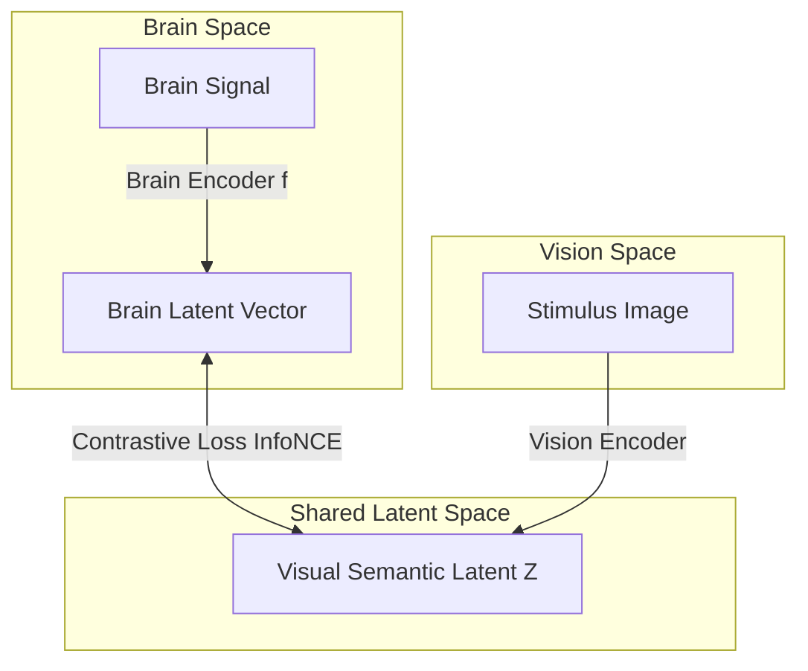

# Latent Alignment

> Projecting neural recordings into a shared, pre-aligned visual-semantic space using contrastive objectives.

Rather than decoding pixels or raw features directly, latent alignment learns to map brain signals into established multi-modal embeddings (such as the CLIP image/text space).

---

## Abstract Paradigm

This paradigm maps heterogeneous brain signals $X$ to a target visual-semantic latent representation $Z_{vision}$ of the corresponding stimulus. The primary objective is to maximize embedding similarity between matched pairs while minimizing similarity for mismatched pairs.

By projecting the brain signal into a shared space, the decoder can leverage zero-shot retrieval (comparing the brain vector against thousands of image/text candidates) or conditional generation.

---

## Abstract Solutions

- **Contrastive Learning (InfoNCE)**: Optimizing cosine similarity between decoded brain embeddings and their ground-truth visual counterparts.
- **Trimodal Alignment**: Jointly aligning brain, visual, and language spaces (Brain $\leftrightarrow$ Image $\leftrightarrow$ Text).
- **Cross-Subject Latent Space**: Aligning multiple subjects' brain activities into a shared cortical coordinate system before mapping to visual latents.
