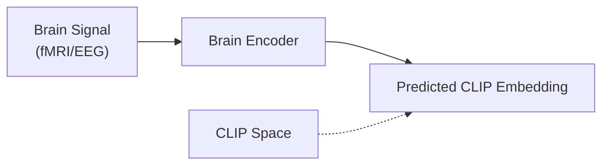

# CLIP

> Contrastive Language-Image Pretraining — the primary bridge between brain signals and semantic visual latent spaces.

---

## Overview

**CLIP** (OpenAI 2021) is trained to align image and text representations via contrastive learning on 400M image-text pairs:

- **Architecture**: Dual-encoder consisting of a ViT/ResNet image encoder and a Transformer text encoder.
- **Training**: InfoNCE loss to maximize the cosine similarity between matched image-text pairs within a batch.
- **Capabilities**: Zero-shot classification, cross-modal retrieval.

---

## Role in Brain Decoding

CLIP is arguably the most important feature space in modern brain decoding:

### Shared Latent Target
CLIP image embeddings are the **most commonly used target space** in brain decoding. Brain encoders (fMRI/EEG) are trained to project neural signals directly into CLIP space.

### Zero-Shot Retrieval
By projecting brain signals into CLIP space, researchers can perform **zero-shot retrieval**: find the closest matching image in a massive database (such as 73,000 COCO candidates in the NSD test set) using simple cosine similarity.

### Input to Generative Decoders
The brain-decoded CLIP embedding acts as the semantic conditioning input for generative decoders (like Stable Diffusion), allowing the decoder to generate highly semantic, coherent reconstructions.
