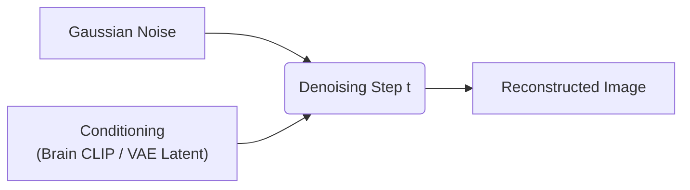
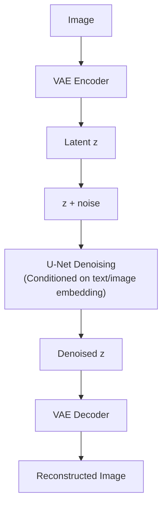

# Diffusion Models

> Generative decoders transforming brain-derived semantic latents into photo-realistic reconstructions.

---

## Overview

Diffusion models generate images by iteratively removing noise from a Gaussian starting point, steered by a conditioning signal:

| Model | Year | Key Feature |
|-------|------|------------|
| **DDPM** | 2020 | Denoising diffusion probabilistic model |
| **DALL-E 2** | 2022 | CLIP-conditioned unCLIP + diffusion |
| **Stable Diffusion** | 2022 | Latent diffusion model (LDM); open-source |
| **SDXL** | 2023 | Higher-resolution SD with improved architectures |
| **FLUX** | 2024 | Flow matching; state-of-the-art visual quality |

---

## Role in Brain Decoding

Diffusion models act as the **generative backbone** (the decoder) in modern brain reconstruction pipelines. Instead of generating pixels directly from noisy brain signals, the brain signals are mapped to latent spaces, which then condition the diffusion process.

---

## Stable Diffusion

**Stable Diffusion** operates in a compressed latent space managed by a Variational Autoencoder (VAE):

### Brain Conditioning Methods
1. **Cross-Attention Conditioning**: The brain-decoded CLIP embedding replaces the standard text prompt embedding in the U-Net cross-attention layers.
2. **VAE Latent Seeding**: A brain encoder directly predicts the low-level VAE latent `z`, which is used to initialize the denoising process (adding a small amount of noise), preserving layout structure.

---

## FLUX

**FLUX** (Black Forest Labs, 2024) is a next-generation model utilizing **flow matching** on a rectified flow trajectory:

- **Flow Matching**: Simplifies training and improves inference stability compared to standard DDPMs.
- **Role in Brain Decoding**: Due to its high textual and structural compliance, researchers utilize FLUX to achieve state-of-the-art reconstruction clarity and text-space alignment (e.g., in **PRISM**).
