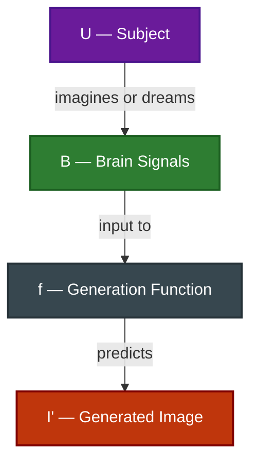

# Brain-to-Image Generation

---

## Definition

Learn a generation function $f: B \rightarrow I'$ that maps brain signals $B$ associated with imagination, memory, or dreaming to a generated image $I'$ representing the subject's intended visual content.

---

## Why It Matters

While reconstruction maps *perceived* stimuli (where the ground truth image exists), generation focuses on *conceived* or *imagined* content:
- **True Mind-to-Image communication**: Allows artists or locked-in patients to synthesize visual ideas without physical tools.
- **Probing Internal Representations**: Helps neuroscientists study how the brain represents concepts internally during memory recall, dreaming, or planning.
- **Zero-Shot Creativity**: Creates novel visual styles or entities that have never been physically seen by the subject.

---

## Solving the Problem

To see how these challenges are solved using abstract decoding paradigms, see:
- **[Latent Alignment](../approaches/latent-alignment.md)** (semantic alignment in CLIP space)
- **[Generative Conditioning](../approaches/generative-conditioning.md)** (guiding pre-trained diffusion models)

---

## Evaluation Challenges

Evaluating brain generation is exceptionally difficult because **no physical ground truth image exists**. Researchers use:
- **Attribute Matching**: Checking if generated images match the requested semantic categories or features (e.g., "a blue sphere").
- **Human Evaluation**: Asking the subject or independent raters to compare the generated output against verbal descriptions of the mental imagery.
- **Representational Consistency**: Verifying if the generated image, when fed back into a visual encoding model, predicts the subject's brain activity during imagery.
