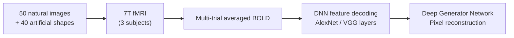

# ds001506 — Deep Image Reconstruction Dataset

> A small-scale but high-resolution 7T fMRI dataset designed for pixel-level image reconstruction experiments.

**Used in**: [Shen et al. 2019](../../works/timeline.md)

---

## Overview

| Property | Value |
| :--- | :--- |
| **Modality** | fMRI (7 Tesla, high-resolution) |
| **Subjects** | 3 healthy adults |
| **Stimuli** | 50 natural images + 40 artificial geometric shapes |
| **Sessions** | Multiple scan sessions per subject |
| **Access** | Public — [OpenNeuro ds001506](https://openneuro.org/datasets/ds001506) |
| **Paper** | Shen et al., *PLOS Computational Biology* 2019 — [DOI](https://doi.org/10.1371/journal.pcbi.1006633) |

---

## Design

Each of the 50 natural images and 40 artificial patterns was presented multiple times across sessions to accumulate reliable BOLD estimates. The averaged multi-trial responses were then decoded to predict DNN features (AlexNet, VGG layers), which were subsequently optimized in pixel space by a deep generator network (DGN) to reconstruct the viewed image.

---

## Significance

- One of the **first datasets specifically collected** for pixel-level reconstruction (not just category identification).
- The 7T resolution enables fine-grained spatial decoding of early visual areas.
- Inclusion of **artificial geometric shapes** (rather than only natural images) tests whether reconstruction captures global structure or only semantic content.

---

## Related Datasets

- [NSD](nsd.md) — the large-scale successor (73k images, 7T, 8 subjects)
- [GOD](god.md) — object-based dataset also used for DNN feature decoding
- [Vim-1](vim-1.md) — the earlier encoding-model benchmark dataset
