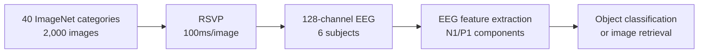

# EEG-ImageNet

> A classic EEG benchmark dataset for rapid visual object recognition using ImageNet stimuli.

---

## Overview

| Property | Value |
| :--- | :--- |
| **Modality** | EEG (128-channel) |
| **Subjects** | 6 healthy adults |
| **Stimuli** | 2,000 images from 40 ImageNet categories (50 images/category) |
| **Presentation** | Rapid Serial Visual Presentation (RSVP) at 100 ms/image |
| **Access** | Public — [GitHub / Zenodo](https://github.com/perceivelab/eeg_visual_classification) |
| **Paper** | Spampinato et al., *CVPR* 2017 — [DOI](https://doi.org/10.1109/CVPR.2017.307) |

---

## Design

Images from 40 ImageNet semantic categories were presented in rapid 100 ms flashes using RSVP. EEG captures the fast **N1/P1 visual evoked potential** components associated with object categorization. The compact structure (40 categories × 50 images) makes it ideal for classification and retrieval benchmarks.

---

## Benchmark Use

Models are typically evaluated on **N-way classification** (40-way or 200-way) or **top-5 retrieval** from the 40-category test split. It serves as the standard small-scale EEG comparison point against larger datasets like THINGS-EEG.

---

## Related Datasets

- [THINGS](things.md) — larger EEG dataset with 1,854 concepts across 50 subjects
- [NSD](nsd.md) — fMRI counterpart for high-spatial-resolution decoding
- [LoongX](loongx.md) — EEG used for active brain-guided image editing rather than passive viewing
