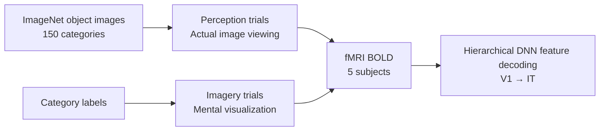

# GOD — Generic Object Decoding

> An fMRI dataset covering object perception and mental imagery, enabling hierarchical feature decoding across the visual system.

**Used in**: [Horikawa & Kamitani 2013](../../works/timeline.md) · [Horikawa & Kamitani 2017](../../works/timeline.md) · [Miliotou et al. 2023](../../works/timeline.md) · [Huo et al. 2024](../../works/timeline.md)

---

## Overview

| Property | Value |
| :--- | :--- |
| **Modality** | fMRI (3 Tesla) |
| **Subjects** | 5 healthy adults |
| **Stimuli** | ~1,250 object images (ImageNet, 150 categories) |
| **Tasks** | Perception (image viewing) and imagery (mental image holding) |
| **Access** | Public — [figshare GOD dataset](https://figshare.com/articles/dataset/Generic_Object_Decoding/7387130) |
| **Paper (2017)** | Horikawa & Kamitani, *Nature Communications* 2017 — [DOI](https://doi.org/10.1038/ncomms15037) |

---

## Dream Dataset (2013)

A separate recording by the same lab published in *Science* (2013), focusing on **sleep imagery**:

| Property | Value |
| :--- | :--- |
| **Subjects** | 3 |
| **Stimuli** | Free-association verbal reports of dream content |
| **Modality** | fMRI (during sleep + post-sleep interview) |
| **Paper** | Horikawa & Kamitani, *Science* 2013 — [DOI](https://doi.org/10.1126/science.1234330) |

---

## Design

The GOD experiment recorded fMRI while subjects either **viewed** object images (perception trials) or were shown category labels and asked to **mentally imagine** the object (imagery trials). This paired design enables direct comparison of perception vs. imagery representations.

---

## Why GOD Matters

- Demonstrates that **imagined** object representations are decodable from fMRI, not just perceived ones.
- Enables **zero-shot** category decoding: predicting unseen object categories by aligning decoded brain features to ImageNet CNN activations.
- Widely used as a secondary benchmark alongside NSD for cross-study comparison.

---

## Related Datasets

- [NSD](nsd.md) — the scale-up successor, natural scene-based
- [ds001506](ds001506.md) — pixel-level reconstruction focused, also 7T
- [THINGS](things.md) — covers 1,854 object concepts across fMRI, EEG, and MEG
