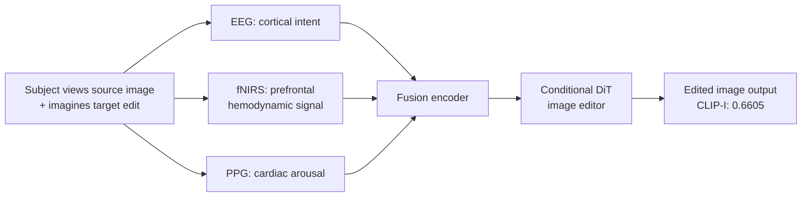

# LoongX Dataset

> The first multimodal BCI dataset for brain-conditioned image editing, combining EEG, fNIRS, and PPG recordings.

**Used in**: [Zhou et al. (LoongX) 2025](../../works/timeline.md)

---

## Overview

| Property | Value |
| :--- | :--- |
| **Modality** | EEG + fNIRS + PPG (simultaneous multimodal) |
| **Subjects** | 12 healthy adults |
| **Stimuli** | ~24,000 image-edit demonstration pairs |
| **Task** | Brain-conditioned image editing (passive and active imagination) |
| **Access** | Partially public — see [arXiv paper](https://arxiv.org/abs/2507.05397) |
| **Paper** | Zhou et al., *NeurIPS* 2025 — [arXiv](https://arxiv.org/abs/2507.05397) |

---

## Recording Modalities

| Signal | Device | Channels | Captures |
| :--- | :--- | :--- | :--- |
| **EEG** | 64-channel wet electrode cap | 64 | Cortical oscillations, visual evoked potentials |
| **fNIRS** | Functional near-infrared spectroscopy | 32 optodes | Prefrontal hemodynamic intent signal |
| **PPG** | Photoplethysmography (wrist sensor) | 1 | Cardiac arousal / cognitive load marker |

---

## Design

Subjects wore a multimodal BCI headset and viewed image-edit pairs while imagining or intending the editing transformation. The synchronized recording enables the model to fuse spatial (fNIRS), temporal (EEG), and physiological (PPG) signals into a unified intent embedding.

---

## Dataset Scale

| Split | Pairs | Description |
| :--- | :--- | :--- |
| Training | ~20,000 | Subject-specific recording+edit pairs |
| Validation | ~2,000 | Held-out sessions per subject |
| Test | ~2,000 | Unseen images, cross-session |

---

## Significance

- **First dataset** pairing multimodal BCI signals with image-editing intent.
- Demonstrates that passive fNIRS + EEG signals correlate with semantic editing directions (e.g., add smile, change background color).
- Results show LoongX's CLIP-I score (0.6605) matches text-prompt editing (0.6558), and exceeds it when combined with speech.

---

## Related Datasets

- [EEG-ImageNet](eeg-imagenet.md) — EEG for passive visual recognition, not active editing
- [THINGS](things.md) — larger-scale EEG/MEG for passive object viewing
- [NSD](nsd.md) — fMRI-based dataset for passive reconstruction
