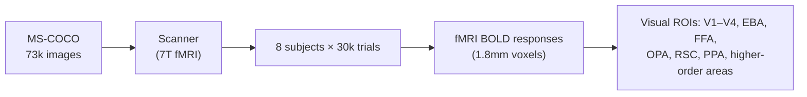

# Natural Scenes Dataset (NSD)

> The premier large-scale 7T fMRI dataset for visual brain decoding research.

**Used in**: [Gaziv et al. 2022](../../works/timeline.md) · [Ozcelik & VanRullen 2023](../../works/timeline.md) · [Huo et al. 2024](../../works/timeline.md) · [Beliy et al. 2026](../../works/timeline.md)

---

## Overview

| Property | Value |
| :--- | :--- |
| **Modality** | fMRI (7 Tesla, ultra-high-resolution) |
| **Subjects** | 8 healthy adults |
| **Stimuli** | 73,000 unique natural images from [MS-COCO](https://cocodataset.org/) |
| **Sessions** | 30–40 scanner sessions per subject |
| **Voxel size** | 1.8 mm isotropic |
| **Access** | Public — [Natural Scenes Dataset](https://naturalscenesdataset.org/) |
| **Paper** | Allen et al., *Nature Neuroscience* 2022 — [DOI](https://doi.org/10.1038/s41593-021-00962-x) |

---

## Design

Subjects viewed each image for 3 seconds while performing a recognition memory task. Each of the 8 subjects completed up to 30,000 viewing trials. A shared core of ~9,000 images was seen by all 8 subjects, enabling cross-subject analyses.

---

## Why NSD is the Standard Benchmark

- **Scale**: The largest publicly available fMRI dataset for vision (>700,000 total scans).
- **Resolution**: 7T ultra-high-field MRI resolves fine cortical laminar structure.
- **Multi-subject shared stimuli**: Enables cross-subject alignment and decoding generalization.
- **Semantic richness**: MS-COCO annotations (captions, object masks) support multimodal supervision.

---

## Related Datasets

- [Vim-1](vim-1.md) — earlier, smaller fMRI image-viewing dataset
- [GOD](god.md) — object-focused fMRI dataset used for cross-study comparison
- [ds001506](ds001506.md) — small high-resolution 7T dataset used by Shen et al.
