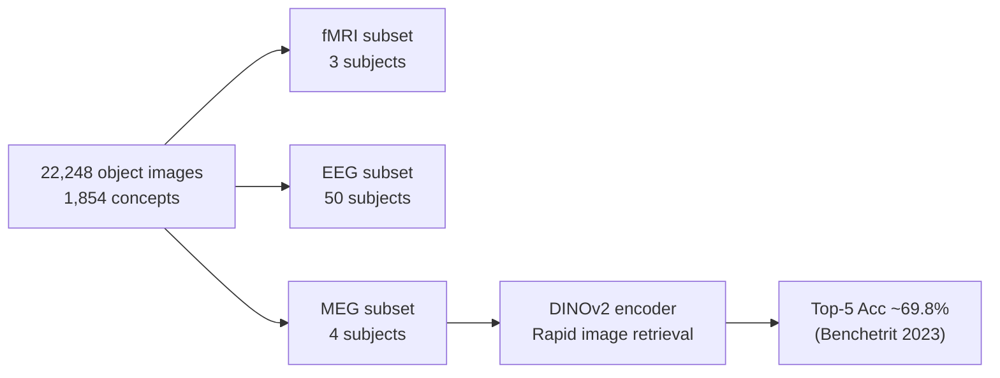

# THINGS

> A multimodal neuroimaging benchmark suite covering 22,248 object images across fMRI, EEG, and MEG recordings.

**Used in**: [Benchetrit et al. 2023](../../works/timeline.md)

---

## Overview

The **THINGS** initiative provides matched recordings of the same stimulus set across three recording modalities, enabling direct cross-modal comparison.

| Subset | Modality | Subjects | Sessions | Access |
| :--- | :--- | :--- | :--- | :--- |
| **THINGS-fMRI** | fMRI (3T) | 3 | Multiple | [OSF](https://osf.io/jpu2t/) |
| **THINGS-EEG** | EEG (64-channel) | 50 | Multiple | [OSF](https://osf.io/3jk45/) |
| **THINGS-MEG** | MEG (306-channel) | 4 | Multiple | [OSF](https://osf.io/qm6pa/) |

- **Stimuli**: 22,248 natural object images representing **1,854 distinct concepts** (e.g., apple, tiger, chair)
- **Paper**: Gifford et al., *NeuroImage* 2022 — [DOI](https://doi.org/10.1016/j.neuroimage.2022.119891)

---

## THINGS-MEG (Primary Benchmark Use)

[Benchetrit et al. 2023](../../works/timeline.md) used the **MEG subset** to demonstrate real-time decoding:

| Property | Value |
| :--- | :--- |
| **Subjects** | 4 |
| **Channels** | 306 (SQUID-based MEG) |
| **Stimuli seen per subject** | ~22,248 images (rapid 100 ms presentation) |
| **Temporal resolution** | ~1 ms |
| **Performance** | Top-5 retrieval acc ~69.8% vs 9.6% chance |

---

## Why THINGS Matters

- **Shared stimuli** across modalities enables direct fMRI/EEG/MEG comparison of representations.
- **1,854 diverse concepts** provide broad semantic coverage beyond ImageNet categories.
- **Large EEG N=50** allows population-level statistics on temporal dynamics of visual processing.
- MEG captures the **rapid ~100 ms object identification** time-course unavailable from fMRI BOLD.

---

## Related Datasets

- [NSD](nsd.md) — complementary large-scale fMRI benchmark for natural scenes
- [GOD](god.md) — also objects, focuses on imagery vs. perception contrast
- [EEG-ImageNet](eeg-imagenet.md) — another EEG object dataset with 40 ImageNet categories
