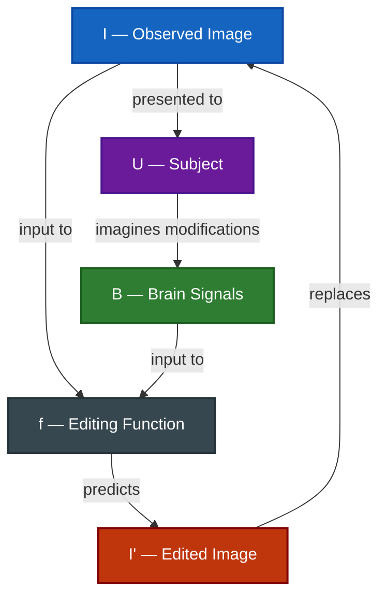

# Definition

> Learn an editing function $f: (I, B) \rightarrow I'$ that maps an observed image $I$ and brain signals $B$ recorded while the subject imagines modifications to $I$ into an edited image $I'$ matching the subject's intended changes.

