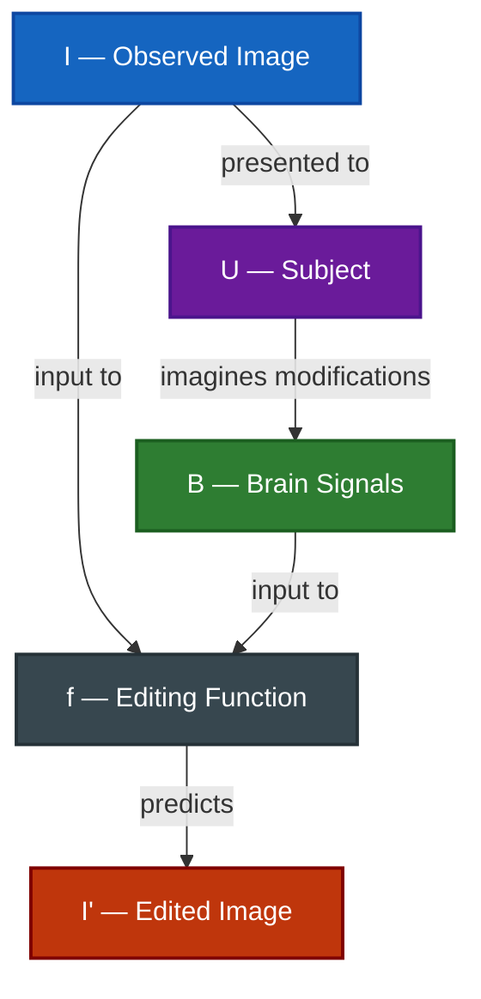

# Brain-to-Image Editing

---

## Definition

Learn an editing function $f: (I, B) \rightarrow I'$ that maps an observed image $I$ and brain signals $B$ recorded while the subject imagines modifications to $I$ into an edited image $I'$ matching the subject's intended changes.

---

## Motivation

- Existing brain-to-image reconstruction methods only recover perceived or imagined images.
- Many applications require modifying an existing image rather than generating a new one.
- Reconstructing an entire image is inefficient for localized or attribute-level changes.
- Brain-to-image editing aims to decode the user's intended modifications to a reference image.

---

## Significance

- Shifts brain decoding from understanding **what a subject sees** to **how a subject wants an image to change**.
- Introduces intention-driven and interactive brain-computer interfaces.
- Enables finer-grained control than traditional reconstruction tasks.
- Establishes a foundation for brain-guided creative and assistive systems.

---

## Applications

- **Hands-Free Image Editing**: Allows users to edit images without keyboards, mice, touchscreens, or text prompts.
- **Accessibility Tools**: Provides creative interfaces for users with motor or speech impairments.
- **Brain-Guided Creative Systems**: Enables image manipulation driven directly by cognitive intent.
- **Adaptive Human-AI Interfaces**: Allows AI systems to infer user preferences from neural feedback.

---

## Challenges

- **Intent Decoding**: The model must infer the desired change rather than the current visual content.
- **Reference Preservation**: Unmodified regions of the image should remain unchanged.
- **Weak Neural Signals**: Editing intent is often subtle and difficult to measure reliably.
- **Semantic Ambiguity**: Similar neural patterns may correspond to multiple possible edits.
