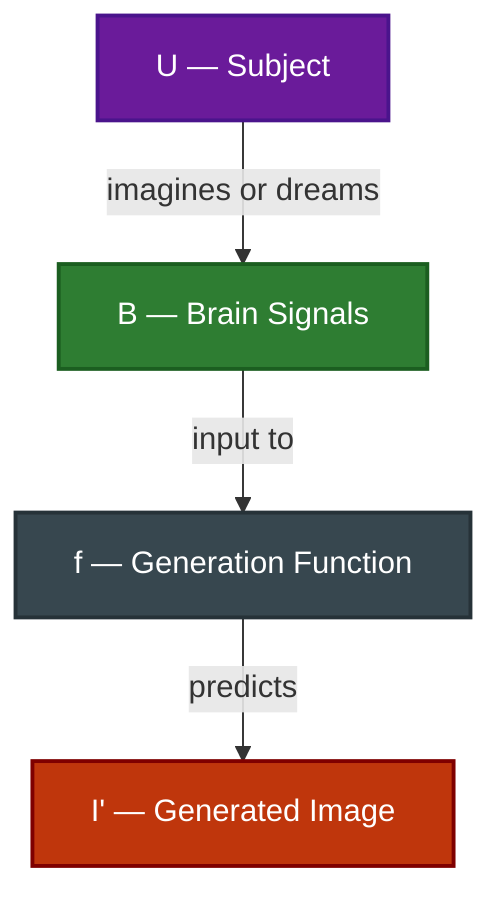

# Brain-to-Image Generation

---

## Definition

Learn a generation function $f: B \rightarrow I'$ that maps brain signals $B$ associated with imagination, memory, or dreaming to a generated image $I'$ representing the subject's intended visual content.

---

## Motivation

- Reconstruction is limited to perceived stimuli where a ground-truth image exists.
- Many applications require synthesizing purely internal visual content from imagination or memory.
- Artists and assistive users need to express visual ideas without keyboards, prompts, or manual tools.
- Generation extends brain decoding from observed perception to internally conceived imagery.

---

## Significance

- Enables **true mind-to-image communication** for creative and assistive applications.
- Helps neuroscientists study **internal visual representations** during memory recall, dreaming, or planning.
- Supports **zero-shot creativity** — synthesizing novel visual content never physically seen by the subject.
- Establishes a foundation for brain-guided generative and interactive systems.

---

## Applications

- **Assistive Communication**: Allows locked-in or motor-impaired users to express visual ideas without physical tools.
- **Creative Tools**: Enables artists to synthesize imagery directly from mental imagery.
- **Neuroscience Research**: Probes how the brain represents concepts during recall, dreaming, or planning.
- **Brain-Guided Generative Interfaces**: Supports human-AI collaboration driven by neural intent rather than text prompts.

---

## Challenges

- **No Ground Truth**: No physical reference image exists, making objective evaluation difficult.
- **Attribute Matching**: Semantic categories or features can be checked, but fine-grained details cannot.
- **Human Evaluation**: Often relies on subject or rater judgments against verbal descriptions of mental imagery.
- **Representational Consistency**: Hard to verify whether generated images match the subject's internal representation.
- **Weak Neural Signals**: Imagined or recalled content often produces weaker and noisier brain signatures than perception.
