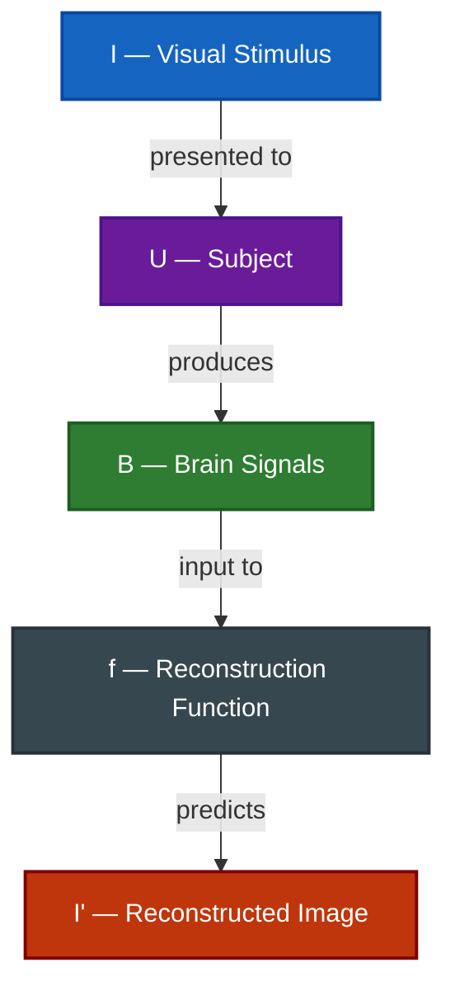

# Brain-to-Image Reconstruction

---

## Definition

Learn a reconstruction function $f: B \rightarrow I'$ that maps brain signals $B$ to a reconstructed image $I'$ that approximates the original visual stimulus $I$.

---

## Motivation

- Brain signals encode rich visual information during perception.
- Recovering seen images tests the limits of neural decoding and brain-visual alignment.
- Reconstruction provides a concrete benchmark with known ground truth for model development.
- Progress in reconstruction underpins downstream tasks such as generation and editing.

---

## Significance

- Demonstrates the **depth of information** encoded in brain signals.
- Enables research into **visual consciousness and perception**.
- Serves as a rigorous test for brain-visual alignment models.
- Has direct implications for **BCIs** (e.g., restoring visual experience for the visually impaired).

---

## Applications

- **Visual Prosthetics**: Restores or approximates lost visual experience for the visually impaired.
- **Neuroscience Research**: Probes how the brain represents and processes visual stimuli.
- **BCI Development**: Provides a foundational decoding task with measurable ground truth.
- **Model Benchmarking**: Standard setting for comparing brain-to-image methods across modalities and architectures.

---

## Challenges

- **Subject Generalization**: Most models require substantial per-subject training data.
- **Imagined Images**: Reconstruction of purely imagined (not perceived) images remains harder.
- **Temporal Resolution**: fMRI-based reconstruction cannot capture temporal dynamics of perception.
- **Scaling**: Larger datasets and multi-subject models improve performance but require significant compute.
- **Multi-Level Evaluation**: Quality must be assessed with both low-level metrics (SSIM, PixCorr) and high-level metrics (CLIP-I, retrieval accuracy).
