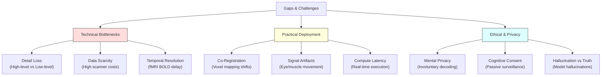

# Challenges & Ethical Issues

> Technical limitations, practical BCI deployment bottlenecks, and ethical considerations surrounding mental privacy and cognitive consent.

---

## Key Challenges and Gaps

The conversion of neurophysiological responses to high-fidelity visual representations faces several structural and physical bottlenecks:

---

## Technical Gaps

### Detail Loss (Semantics vs. Structure)
Decoded images often capture only coarse content: high-level semantics (object category, rough layout) are preserved much better than fine details (edges, textures). For example, MEG-decoded images retain category but blur low-level structure. This is due to the inherent spatial resolution limits of non-invasive sensors. Even with high-resolution 7T fMRI, models must often trade low-level pixel similarity for high-level generative plausibility.

### Data Scarcity
Functional imaging is highly expensive, meaning training datasets typically contain only tens of thousands of samples across a few individuals. This makes training deep networks from scratch prone to severe overfitting. Modern architectures (NeuroPictor, Brain-IT) are exploring multi-subject pretraining to establish neural scaling laws and mitigate raw scanner hour requirements.

### Temporal Dynamics
Most decoding models are optimized for static visual stimuli (images). Reconstructing continuous, dynamic streams (such as video or natural movement) remains extremely challenging. While early models (Nishimoto, 2011) used sliding-window decoders, modern generative architectures have not fully integrated real-time video generation from fluctuating BOLD/EEG time-series.

---

## Practical Challenges

- **Co-registration**: Aligning brain voxel spaces across scanning sessions or between different subjects is computationally hard. Slight changes in head positioning inside the scanner coil shift coordinate layouts.
- **Signal Nonstationarity**: Brain states drift due to fatigue, learning effects, or baseline physiological changes, degrading a trained decoder's accuracy over time.
- **BCI Trade-offs**: High-spatial decoders (fMRI) require massive static equipment and are non-real-time due to hemodynamic lag. High-temporal portable decoders (EEG) suffer from extreme signal degradation and low Signal-to-Noise Ratio (SNR).

---

## Ethical and Privacy Concerns

### Mental Privacy & Surveillance
As decoders improve, the potential to access private cognitive states increases. While non-invasive brain reading is currently limited to active, cooperative tasks (decoding drops to near-chance if the subject performs distracting tasks like mental arithmetic), future architectures might decode semantic visual memories or imagery without active cooperation.

### Cognitive Consent
Consent must be treated as a technical requirement, not just a legal check. Passive recording could expose intent or visual processing patterns. Encryption of raw brain signals and localized edge-processing are vital future constraints to prevent unauthorized server-side decoding of neural activity.

### Generative Hallucination vs. Neural Truth
Using powerful generative models (like Stable Diffusion or FLUX) introduces a distinct ethical risk: **generative hallucination**. Since the model produces realistic outputs from incomplete brain latents, it may render features (such as faces or text details) that the user never saw or imagined. Differentiating between true brain readout and generative "make-believe" is critical in clinical or forensic applications.
