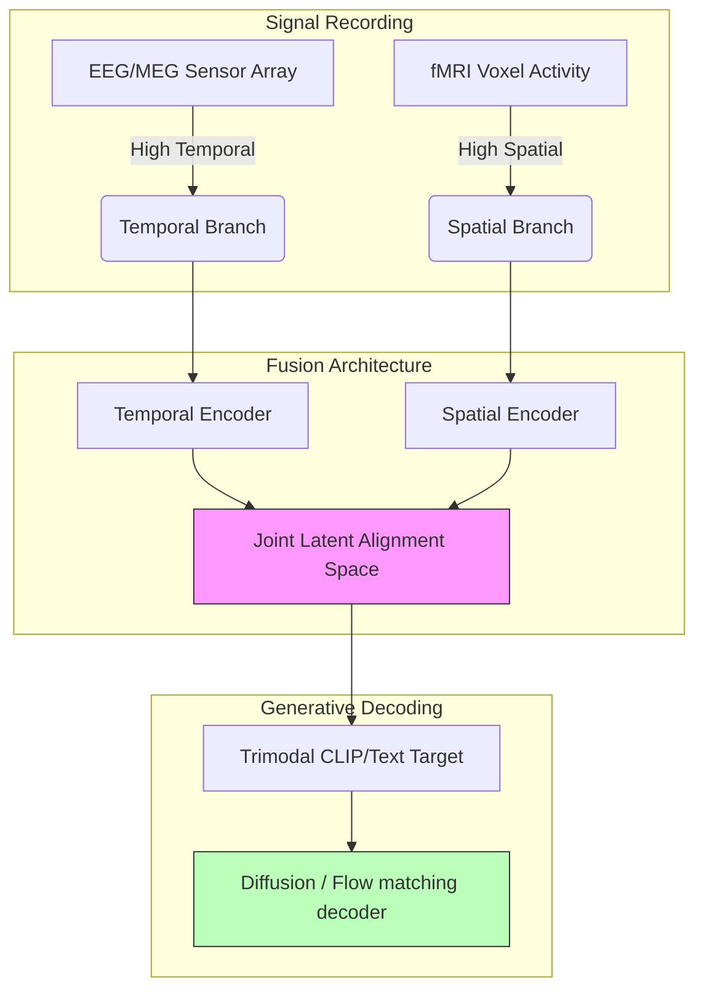
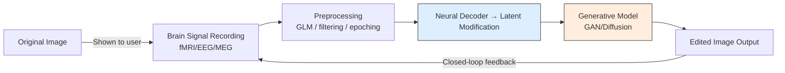

# Future Directions

> Emerging paradigms, proposed experimental designs, and hybrid neural architectures driving the next generation of brain-computer interfaces.

---

## Future Research Frontiers

The intersection of generative AI and non-invasive neural recording is moving toward several promising architectures:

### 1. Cross-Subject Foundation Models
Current decoders are mostly subject-specific. Developing models that map multiple individuals into a unified functional latent space will allow training "foundation" brain decoders. These models can be pre-trained on large-scale pooled datasets (e.g., combining NSD and THINGS-data) and adapted to a new subject with only 10–15 minutes of calibration data, rather than 40+ hours.

### 2. Hybrid Modality Fusion
Combining the spatial resolution of fMRI with the millisecond temporal resolution of EEG or MEG offers a complete "when and where" map of visual cognition.

---

## Proposed Experimental Designs

### Real-Time Closed-Loop Editing (EEG/MEG BCI)
Building interactive systems where a user views an initial generated image and mentally triggers updates.
1. **Stimulus**: Show base image.
2. **Intent**: The subject imagines a modification (e.g., "make the sky starry").
3. **Sensor**: EEG/MEG records real-time cognitive shift.
4. **Decoder**: Classifies the target editing direction in latent space.
5. **Update**: Applies local inpainting/diffusion tweaks in real time, iterating based on visual feedback.

### Latent-Space Attribute Mapping
Design tasks where subjects focus on changing specific attributes of an image to isolate latent control directions:
- Show a neutral face.
- Cue the subject to "imagine the person smiling".
- Use the recorded brain signals (EEG or fMRI) to isolate the specific semantic editing vector in a GAN or Diffusion latent space.
- Apply this vector to edit new, unseen faces.

---

## Brain-Guided Image Editing Experimental Pipeline

The flowchart below represents the abstract data flow for an interactive, closed-loop brain-guided image editing system:

