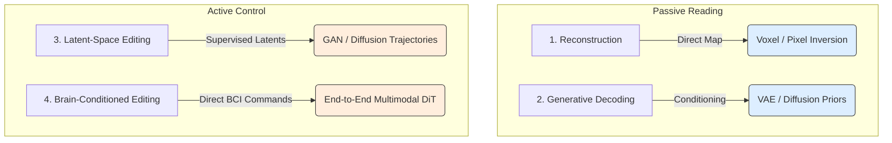

# Related Works: Overview

> An introduction to the vision-brain decoding and editing literature, summarizing the historical evolution from category retrieval to active neural editing.

---

## Executive Summary

Recent advances in vision–brain modeling have moved from simple image classification to rich image reconstruction and editing. Early work (e.g., Kay *et al.*, 2008) showed that object categories can be decoded from fMRI. Later work (Nishimoto *et al.*, 2011) even reconstructed movie clips from fMRI. Modern methods leverage deep generative models (VAEs, GANs, diffusion models, Transformers) to translate brain signals into images. For example, Shen *et al.* (2019) decoded DNN features from fMRI and used a learned generator to produce recognizable image reconstructions. More recent diffusion-based methods (e.g., Ozcelik & VanRullen, 2023) achieve state-of-the-art reconstructions on large fMRI datasets by combining coarse VAE reconstructions with latent diffusion models.

Meanwhile, the first "brain-supervised" editing systems have emerged: Davis *et al.* (2022) used EEG to learn latent GAN directions for semantic edits, and Zhou *et al.* (2025) showed that multimodal neuro-signals (EEG/fNIRS/PPG) can drive a diffusion-based image editor ("LoongX") with performance comparable to text prompts. Despite these gains, reconstructions often capture high-level content but miss fine detail, and work best on seen categories. Decoding is typically limited to perception (not imagination) unless much training is available.

---

## Categories of Approaches

The research landscape can be categorized into four primary paradigms based on the decoding target and interaction model:

### 1. Reconstruction (Image Decoding)
Classical image-reconstruction maps brain signals to pixel- or feature-space representations. These include early linear/Bayesian approaches (Kay 2008; Nishimoto 2011) and DNN-based pipelines (Shen 2019) that optimize pixels to match predicted DNN features. Such methods output an image directly from fMRI/EEG signals.

### 2. Generative Decoding
Uses deep generative priors (VAEs, GANs, Diffusion) to produce plausible, high-quality images. Examples include Gaziv *et al.* (cycle-consistent VAE), Ozcelik & VanRullen (latent diffusion), Miliotou (HVAE), and Brain-IT (transformer+diffusion). These often combine coarse decoding (e.g., VAE output) with conditional generation for high perceptual fidelity.

### 3. Latent-Space Editing
Learns to use brain signals to control image latents. Davis *et al.* (2022) showed that task-driven EEG signals can identify GAN latent directions corresponding to semantic attributes; these latent vectors are then used to edit new images. NeuroPictor (2024) similarly disentangles fMRI into high/low latent features and demonstrates swapping semantic latents between images. This category focuses on how brain intent can manipulate image features rather than purely reconstructing them.

### 4. Brain-Conditioned Editing
End-to-end image editing triggered by brain states. LoongX (2025) exemplifies this: it takes raw neural signals (EEG/fNIRS/PPG) as input and outputs an edited image via a diffusion transformer. In practice, this means a user views an image and imagines an edit (or thinks a command), and the system produces an edited image reflecting that intent. This emerging area aims to replace manual editing (text or click-based) with direct cognitive control.

---

## Historical Eras of Brain Decoding

### 2008–2015: Foundational Works
Early neuroimaging studies showed category decoding or simple image reconstruction from fMRI (e.g., Kamitani lab). Kay *et al.* (2008) decoded seen natural images from V1 fMRI. Nishimoto *et al.* (2011) reconstructed dynamic movie clips by matching fMRI to a large video database. Horikawa *et al.* (2013, 2017) decoded dreamed and imagined objects via hierarchical CNN features.

### 2019: Deep Reconstructions
Shen *et al.* applied deep neural networks: they decoded hierarchical DNN features from 7T fMRI and optimized pixels (via a learned generator) to match them. Reconstructions were recognizable and generalized to artificial shapes and some imagery. This signaled the move to end-to-end deep decoding.

### 2022: Self-Supervision & EEG Editing
Gaziv *et al.* introduced a cycle-consistency approach, training image $\leftrightarrow$ fMRI and fMRI $\leftrightarrow$ image nets on millions of unpaired images. This yielded unprecedented zero-shot reconstructions and enabled 1000-way semantic classification of unseen classes from fMRI. Davis *et al.* (CVPR'22) pioneered latent editing: they showed EEG-recorded brain responses can supervise learning of GAN latent directions (e.g., "smile" vs "not smile") for semantic face edits.

### 2023: Diffusion and Hierarchical Models
Ozcelik & VanRullen (Sept 2023) presented Brain-Diffuser, a two-stage diffusion pipeline using NSD data: (1) VDVAE for coarse layout, (2) Versatile Diffusion (CLIP-guided) for detail. This model outperformed previous SOTA on both pixel and CLIP metrics. Miliotou *et al.* (ICML 2023) mapped fMRI voxels to layers of a Hierarchical VAE (HVAE) latent space, aligning early visual areas to early latent layers, which improved reconstruction quality.

Benchetrit *et al.* (preprint, 2023) used MEG (22,448 images, THINGS-MEG dataset) with a DINOv2-based encoder/decoder. They report ~69.8% top-5 retrieval (vs ~68% with fMRI) and ~7$\times$ better than linear decoding, marking progress toward real-time decoding.

### 2024–Present: Cross-Subject & Active Editing
Huo *et al.* (2024 arXiv) introduced NeuroPictor, which pretrains on multiple subjects and splits decoding into separate high-level (semantic) and low-level (detail) networks. Notably, it can swap high-level latent features between fMRI signals to manipulate semantics while preserving structure.

Zhou *et al.* (NeurIPS 2025) released LoongX, a hands-free image editor driven by multimodal neuro-signals (EEG/fNIRS/PPG). They trained on ~24k editing demonstrations; LoongX matches text prompts in CLIP metrics and even exceeds them when combined with speech.

Finally, Beliy *et al.* (2026) propose Brain-IT, a transformer-based model that clusters fMRI voxels and predicts both low-level (VGG) and high-level (CLIP) features. Brain-IT achieves the most faithful reconstructions to date, and crucially can adapt to a new subject with only ~1 hour of data (instead of 40 h).
