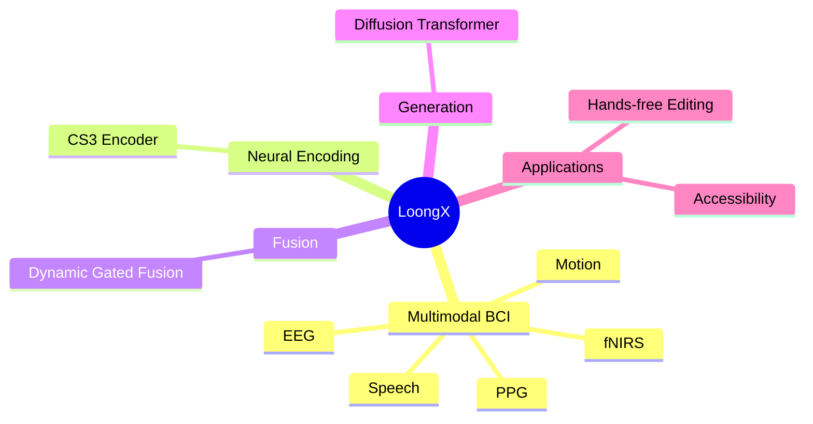
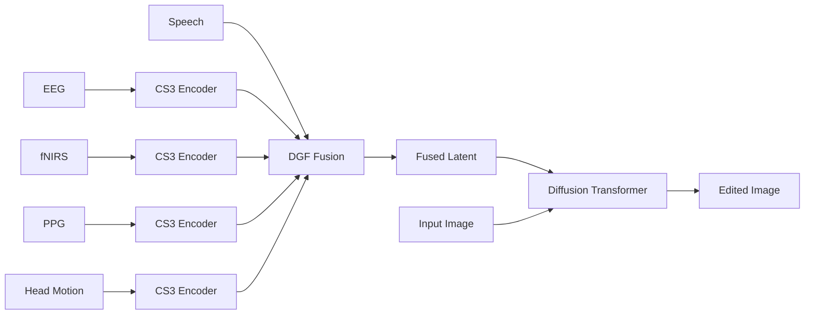

# Neural-Driven Image Editing (Zhou et al., 2026)

## Executive Summary

This paper introduces **LoongX**, a multimodal brain-computer interface framework for hands-free image editing using neural and physiological signals.

Instead of text prompts, LoongX translates user intent captured from **EEG**, **fNIRS**, **PPG**, and **head motion** into latent conditioning signals for a diffusion transformer.

Key findings:

- Neural-only editing achieves performance comparable to text-based editing.
- Combining neural signals and speech achieves the best semantic alignment.
- Different modalities capture complementary aspects of user intent.
- Demonstrates the feasibility of brain-driven creative tools.

---

## Key Ideas



---

## Motivation

Traditional image editing requires explicit interaction:

- Text prompts
- Mouse and keyboard input
- Sketches or masks
- Dragging operations

LoongX aims to replace these interactions with:

```text
User Intent → Brain Signals → Image Edit
```

This can improve accessibility for users with motor or language impairments.

---

## Research Questions

1. Can neural signals reliably represent editing intent?
2. What information does each modality contribute?
3. Are neural signals and speech complementary?

---

## Method Overview



### 1. CS3 Encoder

The Cross-Scale State Space (CS3) encoder extracts long-range temporal and channel dependencies from each modality.

Responsibilities:

- Multi-scale feature extraction
- Temporal modeling
- Channel interaction modeling

---

### 2. Dynamic Gated Fusion (DGF)

DGF adaptively combines modality features using learnable gates.

Responsibilities:

- Modality weighting
- Cross-modal interaction
- Feature selection

---

### 3. Diffusion Transformer

The fused neural representation conditions a fine-tuned diffusion transformer that edits the input image.

```text
(Input Image, Neural Intent) → Edited Image
```

---

## L-Mind Dataset

| Property | Value |
|----------|-------|
| Samples | 23,928 |
| Training | 22,728 |
| Testing | 1,200 |
| Participants | 12 |
| EEG Channels | 4 |
| fNIRS Channels | 6 |
| PPG Channels | 4 |
| Motion Channels | 6 |
| Modalities | EEG, fNIRS, PPG, Motion, Speech |

---

## Results

| Metric | Text Baseline | Neural Only | Neural + Speech |
|--------|--------------|-------------|-----------------|
| CLIP-I | 0.6558 | **0.6605** | - |
| DINO | 0.4636 | **0.4812** | - |
| CLIP-T | 0.2549 | - | **0.2588** |

### Main Findings

- Neural signals alone can drive image editing.
- Neural guidance outperforms text guidance on some visual tasks.
- Speech and neural signals provide complementary information.

---

## Modality Contributions

| Modality | Main Contribution |
|----------|------------------|
| EEG | High-level semantic intent |
| fNIRS | Robust semantic representation |
| PPG | User engagement and physiological state |
| Motion | Contextual behavioral cues |
| Speech | Explicit semantic guidance |

---

## Strengths

- First multimodal neural image editing framework.
- Large-scale multimodal BCI dataset.
- Competitive with text-driven editing.
- Strong accessibility potential.

---

## Limitations

- Difficulty with abstract instructions.
- Requires specialized hardware.
- Neural intent remains difficult to interpret.
- Generalization beyond training instructions is unclear.

---

## Future Directions

- VR and AR editing environments.
- Real-time interactive editing.
- Personalized user adaptation.
- Additional modalities such as eye tracking.

---

## Key Takeaways

- LoongX demonstrates that brain signals can directly guide image editing.
- Multimodal fusion significantly improves performance.
- Neural and speech signals are complementary.
- Brain-driven creative tools are becoming feasible.

